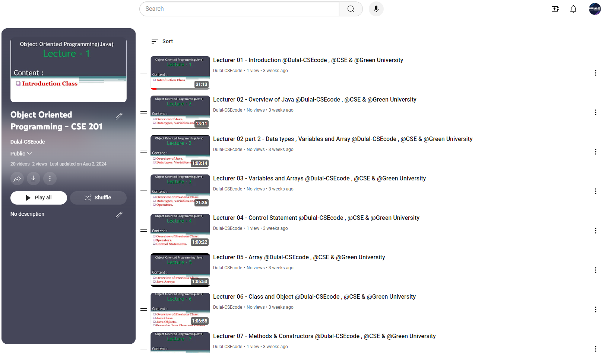

<h1 align="center">--- Object-Oriented-Programming---CSE-201 ---</h1>  
<h3 align="center">-- Spring 2022 --</h3>  
<br />  
Welcome to the Object-Oriented Programming (OOP) CSE-201 repository. This repository contains course materials, assignments, and resources for the Object-Oriented Programming course.  
<br />  
Check out the playlist now and start your learning journey: [Object-Oriented Programming CSE-201 YouTube Playlist Link: ](https://youtube.com/playlist?list=PLEc-WcPXUsjtu7VtqEWihb98zEywtdiZV&si=2sYvaFPyhNxohC9g)
**Happy Learning!**
<br />



  
<br />  

## Table of Contents
- [Introduction](#introduction)
- [Course Outline](#course-outline)
- [Installation](#installation)
- [Prerequisites](#prerequisites)
- [Assignments and Practice Problems](#assignments-and-practice-problems)
- [Usage](#usage)
- [Contributing](#contributing)
- [License](#license)

## Introduction

In this course, we will cover the fundamental concepts of Object-Oriented Programming, including classes, objects, inheritance, polymorphism, and more. The repository provides a comprehensive guide to understanding and applying these principles through problem-solving.

## Course Outline

### 1. Introducing OOP
- **Text:** 1.1
  - Suggested Problems: 1.1, 1.3, 2.1, 3.3, 5.1, 5.5
  - OOP vs SPL, Data Types, Variables, Operators
  - Branching Statements: If-else, Switch

### 2. Iterative Statements
- **Text:** 5.2
  - Suggested Problems: 5.7, 5.8, 5.9, 5.10
  - While, do-while, for, and for each
  - Nested loop, Jumping statements; break, continue

### 3. Introducing Arrays
- **Text:** 3.11
  - Suggested Problems: 3.15, 3.16, 3.21
  - Multi-dimensional Arrays, Sorting, Searching

### 4. Introducing Classes and Objects
- **Text:** 6.1
  - Suggested Problems: 6.3, 6.5, 6.7, 6.9
  - Encapsulation, Constructors, Instance variable hiding, this keyword
  - Garbage collection

### 5-7. Method Overloading
- **Text:** 7.1
  - Suggested Problems: 7.1, 7.3, 7.5, 7.7, 7.9, 7.11, 7.13, 7.15
  - Overloading constructors, Using objects as parameters, Recursion
  - Access control, Static and final, Nested classes

### 8-11. Inheritance
- **Text:** 8.1
  - Suggested Problems: 8.1, 8.3, 8.5, 8.7, 8.9, 8.11
  - Use of super, Creating multi-level hierarchy, Method overriding
  - Abstract classes, Final in class and methods, Using library classes

### 12-14. Packages and Interfaces
- **Text:** 9.1
  - Suggested Problems: 9.3, 9.4, 9.6
  - Access protection, Interfaces, Interfaces vs classes

### 15-16. Exception Handling
- **Text:** 10.1
  - Suggested Problems: 10.3, 10.6, 10.8, 10.9
  - Exception types, Try-catch, throw, throws, finally
  - Creating own exceptions

### 17-19. Multithreading
- **Text:** 11.1
  - Suggested Problems: 11.3, 11.5, 11.7, 11.9
  - Creating threads, Synchronization, Interthread communication

### 20-21. String Class
- **Text:** 15.1
  - Suggested Problems: 15.1, 15.5, 15.8
  - String operations, Big number manipulation using String

### 22-24. AWT and Swing
- **Text:** 23.1-23.3, 29.1-29.3
  - Suggested Problems: 23.5, 23.9, 24.5, 29.6, 29.8
  - Graphical drawing, Animation, Simple software interface design, Database Connection

## Installation

To set up the environment:

1. Clone the repository:
   ```bash
   git clone https://github.com/Dulal-CSEcode/Object-Oriented-Programming---CSE-201.git
   cd Object-Oriented-Programming---CSE-201
    ```

2. Install any required packages or dependencies. For example, on a Debian-based system:

    ```bash
    sudo apt-get update
    sudo apt-get install build-essential
    ```

## Prerequisites

Before you begin, ensure you have met the following requirements:

- You have a basic understanding of programming concepts.
- You have access to a Java compiler.
- You have a basic understanding of Object-Oriented Programming.
- You have Git installed on your computer.

## Assignments and Practice Problems

This repository includes a collection of assignments and practice problems to help reinforce the concepts taught in the course. Each assignment is located in its respective directory with detailed instructions and resources.

## Usage
Navigate to the specific assignment or practice problem directory and follow the instructions provided in the README.md file located in each folder.

## Contributing
Contributions are welcome! To contribute, please follow these steps:

1. Fork the repository.

2. Create a new branch (e.g., feature-branch).

3. Make your changes and commit them (git commit -m 'Add new feature').

4. Push to the branch (git push origin feature-branch).

5. Create a pull request.

Please ensure your code follows the repository's coding standards and includes appropriate tests.

## License
This project is licensed under the MIT License. See the LICENSE file for more details.


<br/>
<h2 align="center"> Thanks for visiting the Object-Oriented-Programming---CSE-201 repository.</h2>
<h3 align="center">© All rights reserved by Dulal-CSEcode @2024 © Department of Computer Science and Engineering, GUB </h3>
